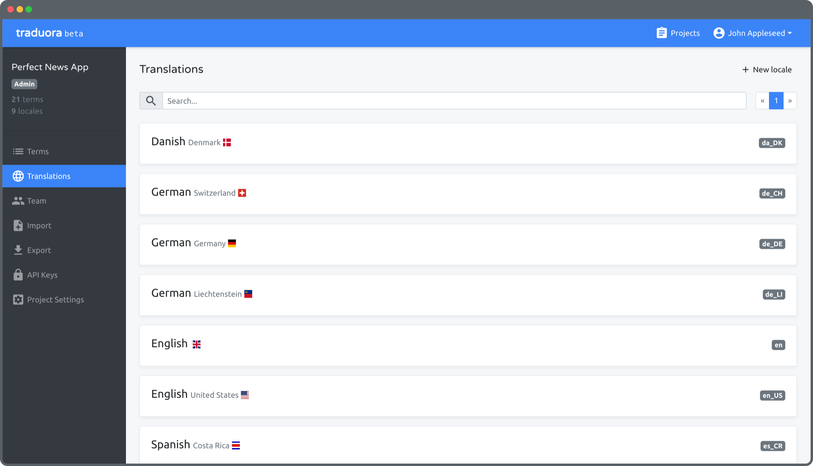

# Ever Traduora Platform 

Ever® Traduora - **Open Translation Management Platform** for teams. 

Once you setup your project you can import and export your translations to various formats, work together with your team, instantly deliver translation updates over the air, and *soon* automatically translate your project via third-party integrations.

We want Traduora to become the home for managing your translation workflow, that's why we have made all of the core product **open-source** with the intention to grow a **community** and enable developers to build on top of it as a platform. 

We are going to also use Traduora from our other open-source platforms (currently https://github.com/ever-co/ever-gauzy and https://github.com/ever-co/ever-demand). You are welcome to check more information about the platforms at our official website - https://ever.co.

## Features

For quick features review, please see our official docs [screenshots](https://docs.traduora.co/docs/screenshots) page.

Short list of platform features:
- 5-minute setup with Docker, Kubernetes or from source
- Find what you are looking for with instant search
- Invite your team, everyone can work together on the same project
- Automate your translation workflow via our REST API
- Import and export to your favorite formats: JSON flat and nested, CSV, YAML flat and nested, Java Properties, XLIFF 1.2, Gettext (po), Strings, Android Resources (xml).
- community contributed CLI available at https://github.com/iilei/traduora-cli (not official CLI)

For more information check out our official website [traduora.co](https://traduora.co), or our docs at [docs.traduora.co](https://docs.traduora.co).

Any missing feature you'd like to see? File an [issue](https://github.com/ever-co/feature-requests/issues) with the feature request to let us know.

## Try it out

Traduora can be run just about anywhere, check out our [Quickstart](https://docs.traduora.co/docs/getting-started) for more info.

Also check out Traduora's [Docker Hub page](https://hub.docker.com/r/everco/ever-traduora) for pre-built images.

### Configuration and Deployment

Please check out the [configuration](https://docs.traduora.co/docs/configuration) and [deployment](https://docs.traduora.co/docs/deployment) documents for more information on deploying Traduora.

## Frequently Asked Questions

Some questions come up over and over again. Be sure to check out our [FAQ](https://docs.traduora.co/docs/faq) first!

## Contact Us

-   [Ever.co Website Contact Us page](https://ever.co/contacts)
-   [CodeMentor](https://www.codementor.io/evereq)
-   For business inquiries: <mailto:traduora@ever.co>
-   Please report security vulnerabilities to <mailto:security@ever.co>

## Security

Security is very important to us. 
Ever® Traduora Platform follows good security practices, but 100% security cannot be guaranteed in any software!
Ever® Traduora Platform is provided AS IS without any warranty. Use at your own risk!
See more details in the [LICENSE](https://github.com/ever-co/ever-traduora/blob/master/LICENSE).

In a production setup, all client-side to server-side (backend, APIs) communications should be encrypted using HTTPS/SSL (REST APIs).

If you discover any issue regarding security, please disclose the information responsibly by sending an email to <mailto:security@ever.co> or on   and not by creating a GitHub issue.

## Contribute

We think it's great that you'd like to contribute to Traduora.

-   Please give us :star: on Github, it **helps**!
-   You are more than welcome to submit feature requests in the [separate repo](https://github.com/ever-co/feature-requests/issues).
-   Pull requests are always welcome! Please base pull requests against the _develop_ branch and follow the [contribution guidelines](https://docs.traduora.co/docs/contributing). 
 
## Contributors

View full list of our [contributors](https://github.com/ever-co/ever-traduora/graphs/contributors).
 
## Internationalization

Of course we'd like Traduora to be available in as many languages as possible. We're setting up a Traduora server for translating Traduora itself, check back soon for more details on how to contribute.

## Changelog

You can check our [changelog](https://docs.traduora.co/docs/changelog) for information about releases.

## License

See [LICENSE](https://github.com/ever-co/ever-traduora/blob/master/LICENSE).

Traduora was created by https://github.com/anthonynsimon (https://anthonynsimon.com) and [contributors](https://github.com/ever-co/ever-traduora/graphs/contributors). In April 2021 it was moved to [Ever](https://ever.co) company for future development.

## Trademarks

**Ever**® is a registered trademark of [Ever Co. LTD](https://ever.co).  
**Ever® Demand™**, **Ever® Gauzy™** and **Ever® OpenSaaS™**  are all trademarks of [Ever Co. LTD](https://ever.co).
The trademarks may only be used with the written permission of Ever Co. LTD. and may not be used to promote or otherwise market competitive products or services.

All other brand and product names are trademarks, registered trademarks or service marks of their respective holders.

