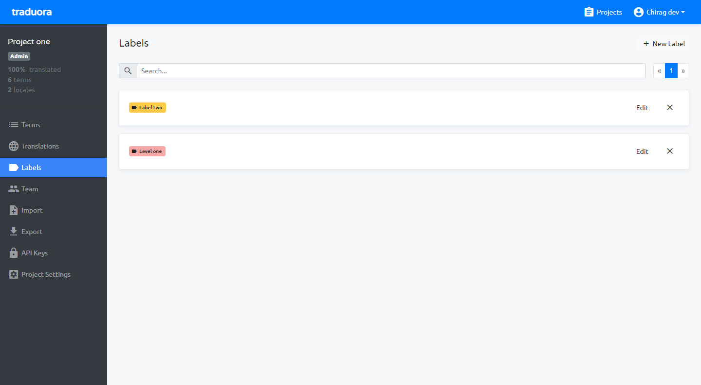
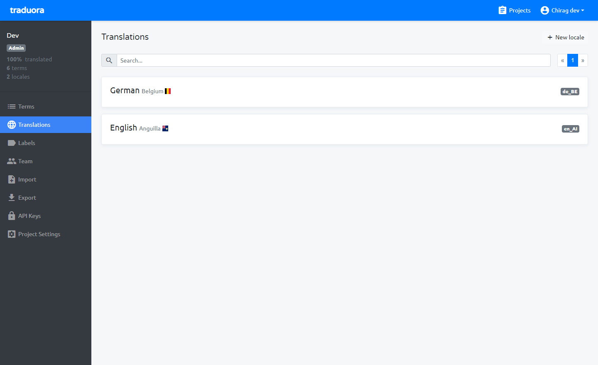

Manage multiple projects here, so add projects here and select project which you want add locale.

Add new project.

From terms module, You can add/edit terms like add variables when using translation (i.e. menu.dashboard, menu.settings)

After add new Term it will showing in listing.

Add new label.

After add new label it will showing in listing.

Add locale for project, select anyone locale which want translate (i.e. select English locale).

After add new locale it will showing in listing.

Select any locale which you want to add term’s translation, after select locale there are showing all the terms and you can add terms translation there.

Select locale which you want to translate, like you want to translate from English to German then select German.

After Selected locale, you can see translation value there and also update the particular locale term’s value.

Assigned label to locale based.

Add projects team member with permission and login with team member and manage locale.

You can add project team and work together with your team.

From import module, you can import translation file in various formats like Android Resources (XML), CSV,XLIFF 1.2, JSON Flat, JSON, YAML Flat, YAML, Java Properties, Gettext (po), Strings, PHP, Resource RESX formats.

From export module, You can export particular locale in various formats like Android Resources (XML), CSV,XLIFF 1.2, JSON Flat, JSON, YAML Flat, YAML, Java Properties, Gettext (po), Strings, PHP, Resource RESX formats.

From API keys module, you can create API key with project role, after add the name and click to save there will show the `client ID` and `secret` key so save the both keys for use of API authentication.

From project settings module, update the basic details of projects, delete project and displaying plan usages.

